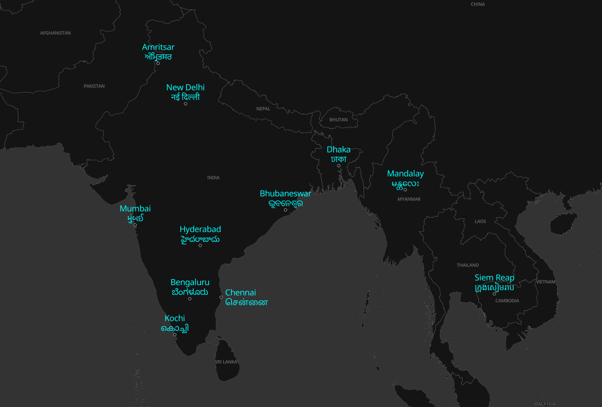

# maplibre-gl-devanagari-text
Render Devanagari text with Harfbuzz in MapLibre GL JS through the RTL plugin hook

## Usage

You can use the MapLibre GL Devanagari Text plugin in the same way you use the mapbox-gl-rtl-text plugin:

```html
<div id="map"></div>
<script>
maplibregl.setRTLTextPlugin(
    'https://wipfli.github.io/maplibre-gl-devanagari-text/dist/maplibre-gl-devanagari-text.js',
    false
);

const map = new maplibregl.Map({
    container: 'map',
    style: 'style.json',
    center: [80, 21],
    zoom: 4,
    hash: "map"
});

</script>
```

## Demo

https://wipfli.github.io/maplibre-gl-devanagari-text/

<a href="https://wipfli.github.io/maplibre-gl-devanagari-text/">

</a>

## Build

```
npm run ci
npm run build-dev
npx serve
```

## Adding a Font

The `glyf` tabel is not needed, so we can first remove it with these steps:

```
pip install fonttools
ttx src/my-font.ttf
sed -i '/<glyf>/,/<\/glyf>/d' src/my-font.ttx
ttx src/my-font.ttx -o src/my-font-without-glyf.ttf
```

Turn .ttf to base64 encoded string by first editing the `font_path` in `to_base64.py` and then running:

```
python3 to_base64.py
```

This should generate a `src/my-font-without-glyf.ttf.base64.txt` file.

## Limitations

- Only works with the fonts provided in the `font` folder. They are copied from https://github.com/wipfli/positioned-glyph-font.
- You cannot use the normal RTL plugin for Arabic and Hebrew when using the Devanagari plugin.
- `text-field`s that use a `format` expression are not yet supported.
- Only works with MapLibre GL JS <= v3.6.1 (smaller than or equal 3.6.1).

## License

- The code in this repo in general is licensed as MIT.
- The harfbuzzjs files are copied from https://github.com/harfbuzz/harfbuzzjs and are published under the apache license:
  - `src/hbjs.js`
  - `src/hb.wasm` 
- The font file `src/NotoSansDevanagari-Regular.ttf` is published under the [Open Font License](https://en.wikipedia.org/wiki/SIL_Open_Font_License).
- The `src/encoding.csv` file is copied from https://github.com/wipfli/positioned-glyph-font and is licensed under the MIT license.