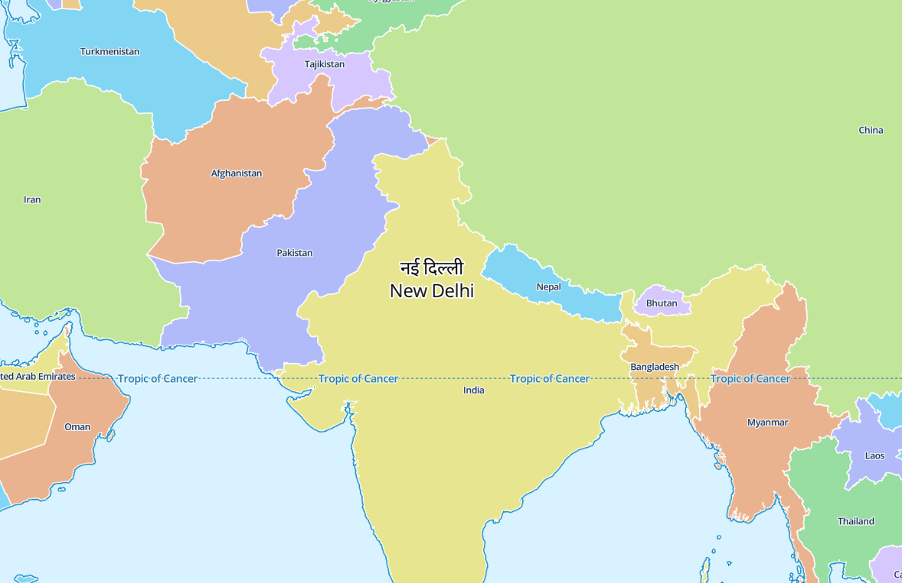
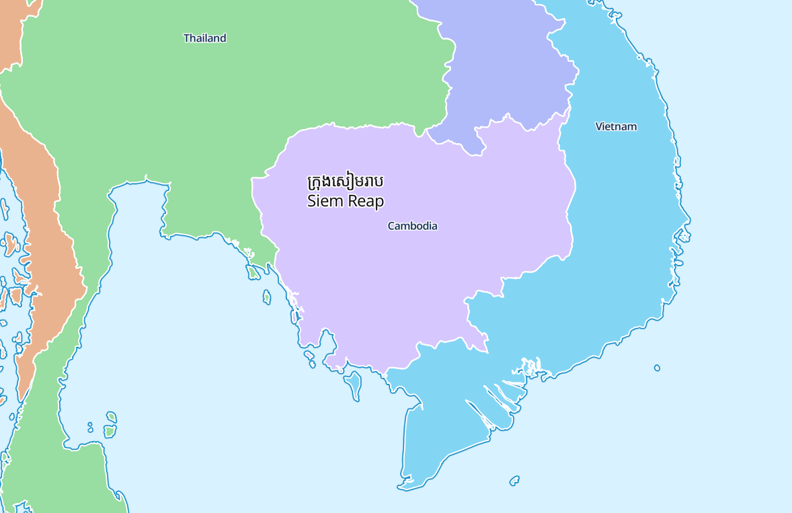

# maplibre-gl-complex-text
Render complex text with Harfbuzz in MapLibre GL JS through the RTL plugin hook.

Supported scripts include: 
- Devanagari ([Demo](https://wipfli.github.io/maplibre-gl-complex-text/devanagari.html))
- Khmer ([Demo](https://wipfli.github.io/maplibre-gl-complex-text/khmer.html))

## Usage

You can use the MapLibre GL Complex Text plugin in the same way you use the mapbox-gl-rtl-text plugin:

```html
<div id="map"></div>
<script>
maplibregl.setRTLTextPlugin(
    'https://wipfli.github.io/maplibre-gl-complex-text/dist/maplibre-gl-complex-text.js',
    false
);

const map = new maplibregl.Map({
    container: 'map',
    style: 'style.json',
    center: [80, 21],
    zoom: 4,
    hash: "map"
});

map.setTransformRequest((url, resourceType) => {

    const fontName = "NotoSansKhmer-Regular-v1";
    // const fontName = "NotoSansDevanagari-Regular-v1";

    if (resourceType === "Glyphs") {
        const match = url.match(/(\d+)-(\d+)\.pbf$/);
        if (match) {
            const start = parseInt(match[1], 10);
            const end = parseInt(match[2], 10);
            if (start >= 57344 && end <= 63743 && (end - start === 255)) {
                return { url: `https://wipfli.github.io/pgf-glyph-ranges/font/${fontName}/${start}-${end}.pbf` };
            }
        }
    }
    return undefined;
});

</script>
```

## Demos

### Devanagari

https://wipfli.github.io/maplibre-gl-complex-text/devanagari.html

<a href="https://wipfli.github.io/maplibre-gl-complex-text/devanagari.html">

</a>

### Khmer

https://wipfli.github.io/maplibre-gl-complex-text/khmer.html

<a href="https://wipfli.github.io/maplibre-gl-complex-text/khmer.html">

</a>

## Build

```
npm run ci
npm run build-dev
npx serve
```

## Adding a Font

The `glyf` tabel is not needed, so we can first remove it with these steps:

```
pip install fonttools
ttx src/my-font.ttf
sed -i '/<glyf>/,/<\/glyf>/d' src/my-font.ttx
ttx src/my-font.ttx -o src/my-font-without-glyf.ttf
```

Turn .ttf to base64 encoded string by first editing the `font_path` in `to_base64.py` and then running:

```
python3 to_base64.py
```

This should generate a `src/my-font-without-glyf.ttf.base64.txt` file.

## Limitations

- Only works with one complex script at a time.
- You cannot use the normal RTL plugin for Arabic and Hebrew when using the Devanagari plugin.

## License

- The code in this repo in general is licensed as MIT.
- The harfbuzzjs files are copied from https://github.com/harfbuzz/harfbuzzjs and are published under the apache license:
  - `src/hbjs.js`
  - `src/hb.wasm` 
- The font files `src/*.ttf` are published under the [Open Font License](https://en.wikipedia.org/wiki/SIL_Open_Font_License).
- The `src/*.csv` files are copied from https://github.com/wipfli/positioned-glyph-font and are licensed under the MIT license.
- Uses the api defined by the [Mapbox RTL Plugin](https://github.com/mapbox/mapbox-gl-rtl-text/), see [License](https://github.com/mapbox/mapbox-gl-rtl-text/blob/main/LICENSE.md).